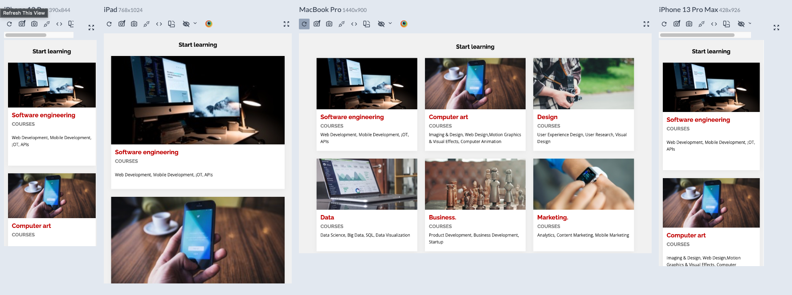

# SubGrid-Exercise

Small exercise Landing Page with CSS GRID & SUBGRIDE & HTML.Responsive
DESKTOP first .

## Screenshots

## Demo

## Note - Keep in mind
REMEMBER THAT IF YOUR LAYOUT IS 

DESKTOP FIRST: IN MEDIA QUERIES GO "max-width" ">"

MOBILE FIRST: IN MEDIA QUERIES GO "min-width"  "<"

## 🛠 Skills
BASIC TOOLS HTML, CSS.

## 🚀 About Me
I'm a Junior full stack developer.
